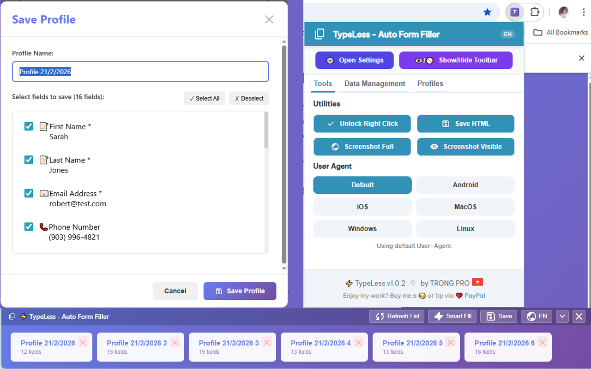

# TypeLess - Auto Form Filler

Browser extension for Chrome/Edge to automatically fill forms with pre-saved profiles.


## Screenshots


## ✨ Key Features

### 🚀 Core Form Filling
- ⚡ **One-Click Fill**: Fill entire forms instantly with saved profiles
- 📝 **Unlimited Profiles**: Create and manage unlimited profiles for different scenarios
- 🎯 **Smart Field Detection**: Automatically identifies form fields and matches them with profile data
- 🔄 **Quick Switch**: Seamlessly switch between profiles for different contexts

### 🧠 Smart Fill Technology
- 🤖 **Mock Data Generation**: Automatically generate realistic test data (names, emails, phones, addresses)
- ⚡ **Lightning Fill**: Click the bolt icon to instantly populate empty fields
- 🎲 **Randomized Data**: Each Smart Fill generates unique, realistic data for testing

### 🌍 Multi-Language Support
- 🇺🇸 English
- 🇻🇳 Vietnamese  
- 🇨🇳 Simplified Chinese
- 🇹🇼 Traditional Chinese
- 🇯🇵 Japanese
- 🇰🇷 Korean
- 🔄 **Dynamic Translation**: Interface and field labels translate automatically

### 🛠️ Advanced Tools
- 💾 **Save HTML**: Export current form state as HTML file for debugging
- 🖱️ **Unlock Right-Click**: Bypass websites that disable context menus
- 📸 **Screenshot Capture**: Take full page or visible area screenshots
- 📱 **Mobile Emulation**: Simulate Android/iOS user agents and behaviors
- 🔄 **User Agent Switching**: Change browser user agent for testing

### 💾 Data Management
- 📤 **Export Profiles**: Backup all profiles to JSON file
- 📥 **Import Profiles**: Restore profiles from backup file
- 📋 **Copy/Paste**: Duplicate profiles between tabs or machines
- 🗑️ **Delete Management**: Remove individual profiles or clear all data

### ⌨️ Keyboard Shortcuts
- `Ctrl+Shift+H` (`Command+Shift+H` on Mac): Toggle toolbar visibility

### 🎨 User Interface
- � **Modern Design**: Clean, intuitive interface with Material Design icons
- 🎯 **Floating Toolbar**: Non-intrusive toolbar that appears on all pages
- 📱 **Responsive**: Works perfectly on desktop and mobile browsers
- 🌙 **Theme Support**: Consistent styling across different browser themes

### 🔒 Privacy & Security
- 🔐 **100% Local Storage**: All data stored locally on your device
- 🚫 **No Cloud Servers**: No data ever leaves your browser
- 🛡️ **No Tracking**: No analytics or usage tracking
- 🔒 **Secure Encryption**: Browser's built-in secure storage API

## 📥 Installation

### Chrome/Edge Developer Mode

1. **Download Source**
   - Clone or download this repository.
   - Unzip the file.

2. **Open Extensions Page**
   - Chrome: `chrome://extensions/`
   - Edge: `edge://extensions/`

3. **Enable Developer Mode**
   - Toggle the switch in the top right corner.

4. **Load Extension**
   - Click "Load unpacked".
   - Select the `FormFillerExtension` folder.

## 🚀 Usage

### 1. Save Profile
- Fill in information on a web form.
- Click the **TypeLess** icon on the toolbar (bottom right) or popup.
- Select "💾 Save Form".
- Name your profile and choose the fields to save.

### 2. Auto Fill
- **Method 1**: Open Toolbar (bottom right circle button) -> Select Profile.
- **Method 2**: Open Popup (extension icon) -> Click Play ▶️ button.

### 3. Smart Fill (Mock Data)
- Click the lightning bolt ⚡ icon on the toolbar.
- The extension will automatically fill empty fields with random emails, phone numbers, names, etc.

### 4. Manage Profiles
- **Export**: Backup all profiles to a JSON file.
- **Import**: Restore profiles from a JSON file.
- **Copy**: Copy a profile to paste into another tab or machine.

## 🛠️ Project Structure

```
FormFillerExtension/
├── manifest.json          # Extension Configuration (Manifest V3)
├── content.js            # Page logic (Smart Fill, DOM interaction)
├── storage.js            # Storage management (Chrome Storage API)
├── i18n.js               # Internationalization (6 languages)
├── popup.html            # Popup UI
├── popup.js              # Popup Logic
├── styles.css            # UI Styles (Toolbar, Modal)
├── icons/                # Icons (SVG & PNG)
└── fonts/                # Fonts (Be Vietnam Pro, Material Icons)
```

## 🔒 Permissions Explained

TypeLess requires the following permissions to function properly. Each permission is used only for its intended purpose:

### Core Permissions
- **`storage`**: 
  - **Purpose**: Save your profiles and preferences locally on your device
  - **Usage**: Stores form profiles, settings, language preferences
  - **Privacy**: 100% local storage, no cloud synchronization

- **`activeTab`**: 
  - **Purpose**: Interact with the current webpage's form fields
  - **Usage**: Read and write form data on the active tab only
  - **Privacy**: Only accesses the tab you explicitly interact with

- **`scripting`**: 
  - **Purpose**: Inject the floating toolbar and auto-fill functionality
  - **Usage**: Add UI elements and execute form filling scripts
  - **Privacy**: Only runs on pages where you activate the extension

### Utility Permissions
- **`clipboardWrite`**: 
  - **Purpose**: Copy profile data to clipboard for sharing
  - **Usage**: Export profiles or copy form data manually
  - **Privacy**: Only copies data when you explicitly click copy

- **`clipboardRead`**: 
  - **Purpose**: Import profile data from clipboard
  - **Usage**: Paste profile data from other tabs or machines
  - **Privacy**: Only reads clipboard when you explicitly paste

- **`contextMenus`**: 
  - **Purpose**: Add TypeLess options to right-click context menu
  - **Usage**: Quick access to profiles and tools without opening popup
  - **Privacy**: No data collection, only provides shortcuts

### Advanced Permissions
- **`declarativeNetRequest`**: 
  - **Purpose**: Modify network requests for enhanced functionality
  - **Usage**: Handle form submissions and bypass certain restrictions
  - **Privacy**: Only modifies requests related to form operations

- **`declarativeNetRequestWithHostAccess`**: 
  - **Purpose**: Extended network request handling with host permissions
  - **Usage**: Advanced form manipulation and mobile emulation
  - **Privacy**: Limited to form-related requests only

- **`downloads`**: 
  - **Purpose**: Download files (HTML exports, screenshots)
  - **Usage**: Save form HTML states and captured screenshots
  - **Privacy**: Only downloads files you explicitly request

### Host Permissions
- **`<all_urls>`**: 
  - **Purpose**: Work on any website containing forms
  - **Usage**: Universal compatibility across all web forms
  - **Privacy**: Only activates when you use the extension

### Security Guarantees
✅ **No Background Activity**: Extension only works when you interact with it  
✅ **No Data Mining**: No collection of browsing history or personal data  
✅ **No Remote Connections**: All functionality works completely offline  
✅ **Minimal Permissions**: Each permission is essential for core functionality  
✅ **Transparent Usage**: All permissions are clearly explained and justified

## 🐛 Troubleshooting

**Q: Fonts displaying as squares?**
A: The extension uses system fonts (Noto Sans CJK) for Chinese/Japanese/Korean to optimize size. Ensure these fonts are installed on your computer.

**Q: Toolbar not showing?**
A: Try refreshing the page (F5). Some sites may block unknown scripts and require manual permission.

## 📝 Changelog

### Version 1.0.2 (Latest)
- 📱 **Mobile Emulation**: Accurate Android/iOS simulation (User-Agent, Platform, Touch, Client Hints).
- 📸 **Screenshot**: Capture full page or visible area of the form.

### Version 1.0.1
- 🌍 Added 4 languages: 🇨🇳 🇹🇼 🇯🇵 🇰🇷.
- 💾 Added **Save HTML** feature.
- 🎨 UI Updates: Button borders, Bold text, New icons.
- 🐛 Fixed font and translation issues.

## 👨‍💻 Author
**TRONG.PRO**

## 📄 License
MIT License
